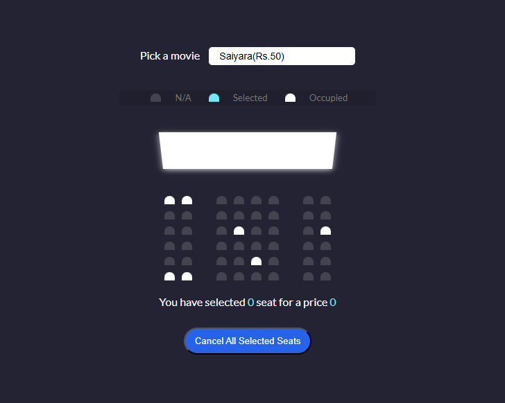
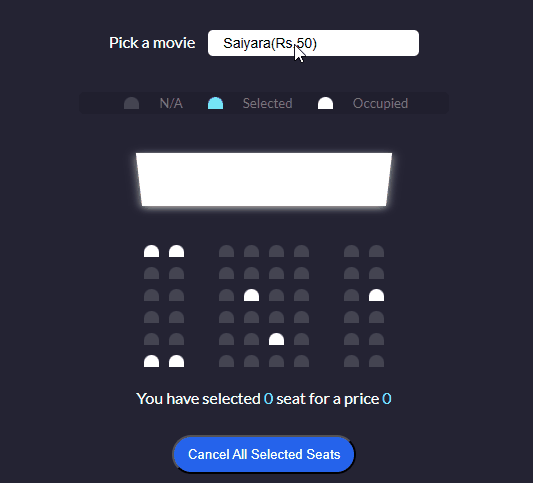

# 🎟️ Movie Seat Booking — Responsive Seat Selector (HTML • CSS • JS)

Select seats, see live counts and total price, and enjoy a clean, responsive UI for a movie theatre layout.  
Live Demo: https://tonmoy-nita.github.io/Movie-seat-booking/

---

## 🧪 Tech Stack

---

## 📸 Preview

  

Optionally add a GIF for interactions:

  

---

## ✨ Features

- Click to select/deselect seats with visual feedback (selected/occupied states)
- Real‑time seat count and total fare calculation
- Movie dropdown to change ticket price
- Fully responsive grid layout for mobile, tablet, and desktop
- Clean, accessible markup with keyboard focus and clear contrasts

---

## 🚀 Live

- GitHub Pages: https://tonmoy-nita.github.io/Movie-seat-booking/

---

## 🗂️ Project Structure
